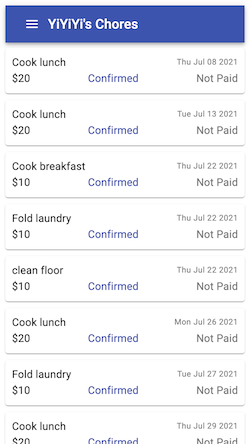

# Share Housework

https://housework.likaiguang.com

A web app to track the housework performed by my ~~roommate~~ wife and me. If she does a house chore, she gets paid by me. If I do some housework, I don't need to pay her, which encourages me to do more.

Technology used:

-  React
-  Recoil
-  Material-UI
-  AWS Amplify
-  AWS Serverless Application Model (Lambda Node.js, DynamoDB, API Gateway)
-  AWS Cognito, IAM, and more...
-  [GitHub: Kaiguang / share-housework-web](https://github.com/Kaiguang/share-housework-web)
-  [GitHub: Kaiguang / share-housework-aws](https://github.com/Kaiguang/share-housework-aws)
