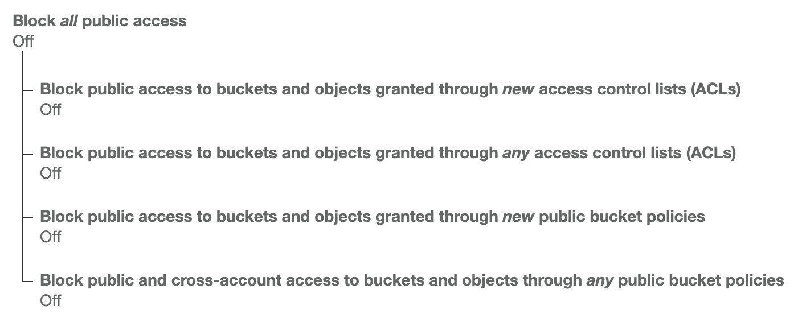

This blog was built using Gatsby and its starter library _gatsby-starter-blog_. It was hosted on AWS using the following services.

- Route 53
- Certificate Manager
- S3
- CloudFront

## 1. Route 53

I bought likaiguang.com. Created a hosted zone, hosted zone is a container for records (A, CNAME) about how to route traffic for a domain.

## 2. Certificate Manager

I first made sure the region selected was **US East (N. Virginia)**, because later in CloudFront it would only show certificates in this region in the drop-down menu. Then I requested a SSL/TLS public certificate with the following domain names.

- likaiguang.com
- www.likaiguang.com

Validation was done by the email method, and the emails arrived instantly.

## 3. S3

I created two S3 buckets using a region near me: _US West (Oregon)_. Each bucket was named after the domain name I wanted to use.

- likaiguang.com
- www.likaiguang.com

### S3 Bucket: likaiguang.com

#### Under Tab: Properties

I enabled bucket for static website hosting, selected _Use this bucket to host a website_ and put _index.html_ as index document, _404.html_ as error document.

#### Under Tab: Permissions

This was the bucket for storing my website, so I set the _Block public access_ by turning off the four options below.



I set the _Bucket Policy_ per below.

```json
{
  "Version": "2012-10-17",
  "Id": "Policy1234567890123",
  "Statement": [
    {
      "Sid": "Stmt4567890123456",
      "Effect": "Allow",
      "Principal": "*",
      "Action": "s3:GetObject",
      "Resource": "arn:aws:s3:::likaiguang.com/*"
    }
  ]
}
```

#### Upload Website from Gatsby Blog Repo

I installed AWS CLI on my local machine, created a IAM user and give it access to my S3 buckets. Ran `aws configure` to give it both _Key ID_ and _Access Key_ for the IAM user.

I installed Gatsby plugin `npm i gatsby-plugin-s3`. This enabled me to deploy the website to my S3 bucket in my Gatsby blog repo.

I added following configurations in the _gatsby-config.js_ file.

```js
{
  resolve: `gatsby-plugin-s3`,
  options: {
    bucketName: `likaiguang.com`,
    acl: null,
    protocol: `https`,
    hostname: `likaiguang.com`,
  },
},
```

I added script `"deploy": "npm run build && gatsby-plugin-s3 deploy",` in the _package.json_ file.

Ran `npm run deploy` to build and upload my website to the S3 bucket.

### S3 Bucket: www.likaiguang.com

This was a redirecting bucket so I didn't upload anything.

#### Under Tab: Properties

I enabled bucket for static website hosting, selected _Redirect requests_ to _likaiguang.com_ target bucket or domain.

#### Under Tab: Permissions

This was a redirecting bucket, so I left permission default. _Block all public access_ was on, _Bucket Policy_ was empty.

## 4. CloudFront

In the distribution creation, I set the _Origin Domain Name_ to the bucket endpoint _likaiguang.com.s3-website-us-west-2.amazonaws.com_, not the S3 bucket _likaiguang.com.s3.amazonaws.com_ from the drop-down.

Changed _Viewer Protocol Policy_ to _Redirect HTTP to HTTPS_.

Under _Alternate Domain Names (CNAMEs)_ I added the two domain names.

- likaiguang.com
- www.likaiguang.com

Under _SSL Certificate_ I selected _Custom SSL Certificate (example.com):_ and chose the certificate in the drop-down I created previously in Certificate Manager.

Left everything else in default.

After creation, I was given a domain name for my distribution _dryg4r2wprzbd.cloudfront.net_.

## 5. Back to Route 53

I added two A records both pointing to the same ALIAS _dryg4r2wprzbd.cloudfront.net_ with the following names.

- likaiguang.com
- www.likaiguang.com

From there, my blog site should be online with https shortly.
