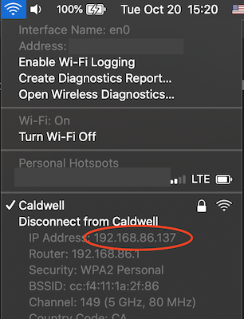

## Gatsby

When developing a website using Gatsby, you can preview and hot reload your website on both you dev machine and mobile device browser for development, using the local network.

```shell
gatsby develop -H "0.0.0.0"
```

The Gatsby CLI will provide you an IP address with port number in the below format.

```shell
On Your Network: http://192.168.***.***:8000/
```

Simply paste it into your mobile device browser to view.

## Next.js

Next.js is slightly different.

```shell
next dev
```

After starting the dev server, take a look at your machine's IP address in the local network. For Mac, you can option + click the Wi-Fi button.



You can use that IP with the port number to view the development site on your mobile devices connected to the same local network. For this example it will be `http://192.168.86.137:3000`.
